# 📅 次回会議アジェンダ

**🗓️ 予定日時**: 2025-11-21
**⏱️ 予定時間**: 60分

## 🎯 会議の目的

- データベーススケーリング戦略の最終決定
- 未解決事項の解決と次のアクションプランの確認
- ベータ版リリースに向けた最終準備の確認

## 👥 参加者

### 必須参加者

- ✅ 山田太郎（プロジェクトマネージャー）
- ✅ 佐藤花子（リードエンジニア）
- ✅ 鈴木一郎（QAリード）
- ✅ インフラチーム代表

### 任意参加者

- 🔹 法務部担当者（ライセンス問題対応）
- 🔹 営業チーム代表

## 📋 議題

### 1. データベーススケーリング戦略の決定 (20分)

**説明**: インフラチームからの提案を元に、スケーリング戦略（垂直/水平スケーリング、キャッシュ戦略）を最終決定する。

**担当**: インフラチーム代表

**必要資料**:
- 📄 スケーリングオプション比較表
- 📄 コスト見積もり資料
- 📄 ロードテスト結果

### 2. ライセンス問題の進捗確認 (10分)

**説明**: サードパーティライブラリのライセンス問題について法務部からの回答を確認。代替案の評価結果も共有。

**担当**: 佐藤花子

**必要資料**:
- 📄 法務部からの正式回答
- 📄 代替ライブラリ評価レポート

### 3. QAリソース配分の最終確認 (15分)

**説明**: 追加QAエンジニアの採用進捗と、外部QAサービス利用の可否を決定。ベータ版リリースまでのテスト計画を最終化。

**担当**: 鈴木一郎

**必要資料**:
- 📄 外部QAサービス見積もり
- 📄 テスト計画書ドラフト
- 📄 採用プロセス進捗レポート

### 4. ベータ版リリースチェックリストレビュー (10分)

**説明**: 12月1日のベータ版リリースに向けた最終チェックリスト項目をレビュー。各担当者の進捗を確認。

**担当**: 山田太郎

**必要資料**:
- 📄 リリースチェックリスト
- 📄 各タスクの進捗状況

### 5. 次のマイルストーンの計画 (5分)

**説明**: ベータ版リリース後の次のマイルストーン（正式版リリース）に向けた大まかなスケジュールを議論。

**担当**: 山田太郎

**合計予定時間**: 60分

## 📝 事前準備事項

1. [ ] インフラチームはスケーリング提案資料を会議24時間前までに共有
2. [ ] 佐藤は法務部との打ち合わせを会議前に完了
3. [ ] 鈴木は外部QAサービスの見積もりを3社以上取得
4. [ ] 全員がリリースチェックリストを事前レビュー
5. [ ] 前回議事録を全員が読んで理解しておく

## 📅 タイムテーブル

```mermaid
gantt
    title 会議タイムテーブル
    dateFormat HH:mm
    axisFormat %H:%M
    データベーススケーリング戦略の決定 :00:00, 00:20
    ライセンス問題の進捗確認 :00:20, 00:30
    QAリソース配分の最終確認 :00:30, 00:45
    ベータ版リリースチェックリストレビュー :00:45, 00:55
    次のマイルストーンの計画 :00:55, 01:00
```

---
*このアジェンダは前回の会議内容から自動生成されました*
