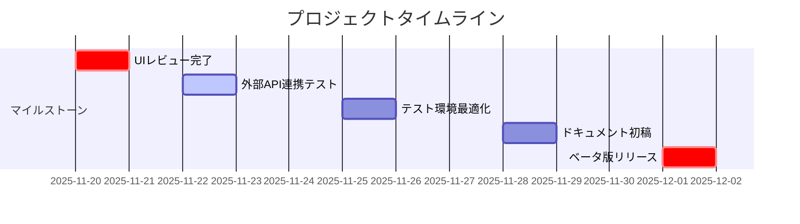
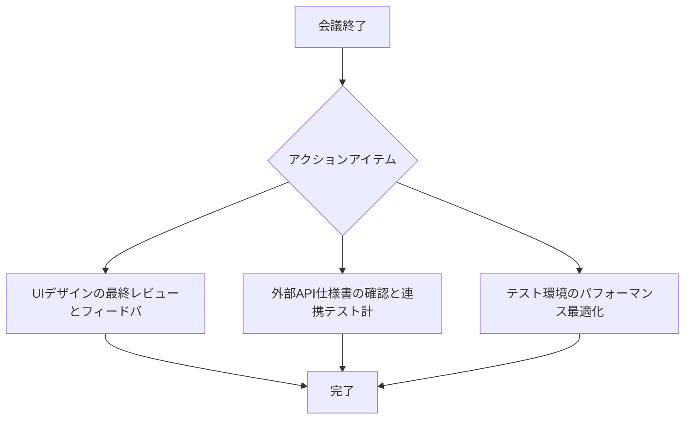

# 📋 会議議事録

**📅 日付**: 2025年11月14日 14:30
**👥 参加者**: 山田太郎, 佐藤花子, 鈴木一郎

## 📝 概要

プロジェクトαの進捗確認と、次のマイルストーンに向けた課題の洗い出しを行いました。開発スケジュールの前倒しが可能かどうか議論し、リソース配分について検討しました。

## 💡 重要なポイント

- ✨ 現在の開発進捗は予定より5日前倒しで進んでいる
- ✨ UIデザインの最終版が完成し、開発チームへ引き継ぎ完了
- ✨ テスト環境のセットアップに想定より時間がかかっている
- ✨ 外部API連携の仕様確認が必要

## ✅ 決定事項

- ✔️ ベータ版リリースを12月1日に前倒しで実施
- ✔️ 追加のQAエンジニア1名を採用プロセス開始
- ✔️ 週次ミーティングを隔週から毎週に変更

## 🎯 アクションアイテム

| 優先度 | タスク | 担当者 | 期限 | 状態 |
|:------:|:-------|:------:|:----:|:----:|
| 🔴 | UIデザインの最終レビューとフィードバック反映 | 山田 | 2025-11-20 | ⬜ |
| 🔴 | 外部API仕様書の確認と連携テスト計画作成 | 佐藤 | 2025-11-22 | ⬜ |
| 🟡 | テスト環境のパフォーマンス最適化 | 鈴木 | 2025-11-25 | ⬜ |
| 🟡 | ユーザードキュメントの初稿作成 | 山田 | 2025-11-28 | ⬜ |
| 🟢 | 社内デモ用プレゼン資料の準備 | 佐藤 | 2025-11-30 | ⬜ |

## ⚠️ 未解決事項

> 以下の事項については会議中に結論が出ませんでした。次回の議論が必要です。

### 🔴 1. データベースのスケーリング戦略

**📌 背景**: ベータ版で予想されるユーザー数が当初見積もりの2倍になる可能性が浮上。現在のデータベース構成では対応できない可能性がある。

**💡 推奨アクション**: インフラエンジニアと緊急ミーティングを設定し、スケーリングオプション（垂直/水平スケーリング、キャッシュ戦略）を評価する。

### 🟡 2. サードパーティライブラリのライセンス問題

**📌 背景**: 使用予定のチャート表示ライブラリのライセンスが商用利用に制限がある可能性が判明。法務部への確認が必要。

**💡 推奨アクション**: 法務部に正式な照会を行うと同時に、代替ライブラリの調査を並行して進める。

## 🤖 AIからの提案・アドバイス

> AIが会議内容を分析し、以下の提案をします。

### ⚙️ 1. テスト自動化の強化を推奨 **[重要]**

**理由**: スケジュールが前倒しになる中、テスト環境のセットアップに遅延が見られます。テスト自動化を強化することで、品質を維持しながら効率化できます。継続的インテグレーション(CI/CD)パイプラインの見直しを検討してください。

### ⚠️ 2. リソース配分のリスク管理 **[重要]**

**理由**: QAエンジニア1名の採用を決定しましたが、採用プロセスには通常2-4週間かかります。12月1日のリリースに間に合わない可能性があります。既存メンバーの業務再配分や、外部QAサービスの一時利用を検討することを推奨します。

### 🌟 3. 段階的ベータリリースの機会 *[中]*

**理由**: 全機能を12月1日に一括リリースするのではなく、11月25日頃に限定ユーザー向けのアルファ版を先行リリースすることで、早期にフィードバックを得られます。これによりリスクを分散できます。

### 🎯 4. ステークホルダーコミュニケーション計画の策定 [低]

**理由**: プロジェクトが前倒しになっていますが、経営陣や営業チームへの進捗共有が会議で言及されていません。定期的な進捗報告の仕組みを作ることで、組織全体の期待値を適切に管理できます。

## ⚡ リスク分析

| リスク | 影響度 | 発生確率 | 軽減策 |
|:-------|:------:|:--------:|:-------|
| データベースのスケーリング不足による本番障害 | 🔴 高 | 🟡 中 | 早急にインフラチームとキャパシティプランニングを実施。ロードテストを前倒しで実行。 |
| QAエンジニア採用の遅延 | 🟡 中 | 🔴 高 | 外部QAサービスの利用を並行検討。既存メンバーのクロストレーニング。 |
| 外部API仕様の不明確さによる開発遅延 | 🟡 中 | 🟡 中 | API提供元との定期ミーティング設定。モックAPIでの並行開発継続。 |
| ライセンス問題による設計変更 | 🟢 低 | 🟡 中 | 代替ライブラリの評価を先行実施。最悪の場合の自社実装コストを見積もり。 |

## 📅 タイムライン



## 🚀 次のステップ

1. インフラチームとのスケーリング戦略ミーティングを今週中に設定（山田）
2. 法務部へライセンス照会を明日朝一で実施（佐藤）
3. 外部QAサービスの見積もり取得（鈴木）
4. 経営陣向け進捗レポートのテンプレート作成（山田）
5. 次回ミーティング日程調整（11月21日 14:00を提案）

## 🔄 アクションフロー



---

## Raw Data (JSON)

```json
{
  "summary": "プロジェクトαの進捗確認と、次のマイルストーンに向けた課題の洗い出しを行いました...",
  "keyPoints": [...],
  "decisions": [...],
  "actionItems": [...],
  "unresolvedIssues": [...],
  "aiSuggestions": [...],
  "timeline": [...],
  "risks": [...]
}
```
